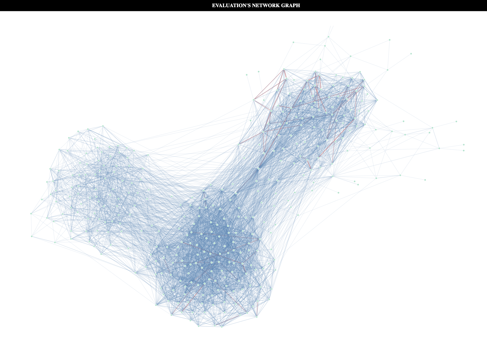
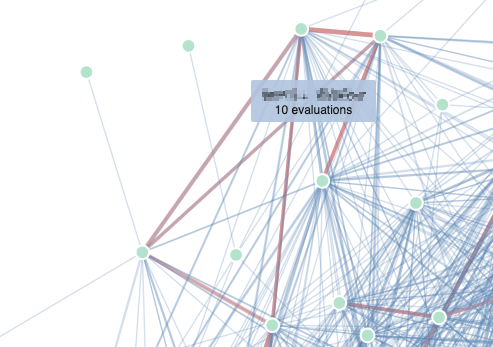

<h1 align="center"><code>42-eval-graph</code></h1>

<div align="center">
  <sub>Created by <a href="">Jordane Gengo (Titus)</a></sub>
</div>

<h1 align="center">Proof-of-Concept</h1>

This project is a simple Proof-of-Concept for the 42network allowing to visualize the evaluations made via a network graph.



<br>
<br>



## Requirements

- 42API app
- Python 3.6+ (tested with 3.12)

## How to run

Create a venv
```
python3 -m venv venv
```

Activate your venv
```
source venv/bin/activate
```

Add the information to your config.yml
```
cp config.sample.yml config.yml
```

Edit pull.py information (CAMPUS_ID, CURSUS_ID, and the time_range) and run pull.py
```
python pull.py
```

The previous command will create a data.json file inside `./web` directory

Open index.html with your favorite browser (tested with Chrome)

<br>

## Potential ideas

- Cluster Detection and Visualization (js-louvain)
- Interactive Info Panel (instead of tooltip)
- Time-Based Filtering
- Heatmap Overlay
- Export Graph as Image
